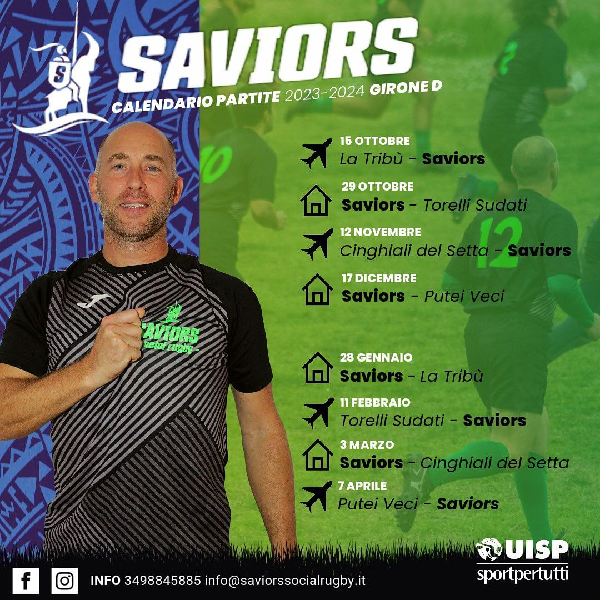

### Calendario UISP 2023/2024

#### Girone D

| Giornata   | Data       | Casa                         | Ospiti                       | Orario | Indirizzo                                                               |
| ---------- | ---------- | ---------------------------- | ---------------------------- | ------ | ----------------------------------------------------------------------- |
| 1a Andata  | 15/10/2023 | La Tribù ASD                 | **Saviors Social Rugby ASD** | 15:00  | via Vicinale Rivalta 233, Casale sul Sile (TV)                          |
| 2a Andata  | 29/10/2023 | **Saviors Social Rugby ASD** | ASD Torelli Sudati RC        | 14:30  | Via Roversano 2815 (FC)                                                 |
| 3a Andata  | 12/11/2023 | Cinghiali del Setta Rugby    | **Saviors Social Rugby ASD** | 14:30  | Via Romita, 2/7, 40128 (BO)                                             |
| 4a Andata  | 26/11/2023 | **Saviors Social Rugby ASD** | RIPOSO                       | -      | -                                                                       |
| 5a Andata  | 26/11/2023 | **Saviors Social Rugby ASD** | Putei Veci Rugby             | 14:30  | Via Roversano 2815 (FC)                                                 |
| 1a Ritorno | 28/01/2024 | **Saviors Social Rugby ASD** | La Tribù ASD                 | 14:30  | Via Roversano 2815 (FC)                                                 |
| 2a Ritorno | 11/02/2024 | ASD Torelli Sudati RC        | **Saviors Social Rugby ASD** | 14:30  | Via Sydney Sonnino 1, Padova oppure Via Jacopo Corrado, 4, 35128 Padova |
| 3a Ritorno | 03/03/2024 | **Saviors Social Rugby ASD** | Cinghiali del Setta Rugby    | 14:30  | Via Roversano 2815 (FC)                                                 |
| 4a Ritorno | 17/03/2024 | **Saviors Social Rugby ASD** | RIPOSO                       | -      | -                                                                       |
| 5a Ritorno | 07/04/2024 | Putei Veci Rugby             | **Saviors Social Rugby ASD** | 14:30  | Gesbury Park' Via Forte Gazzera 2, Mestre (VE)                          |
