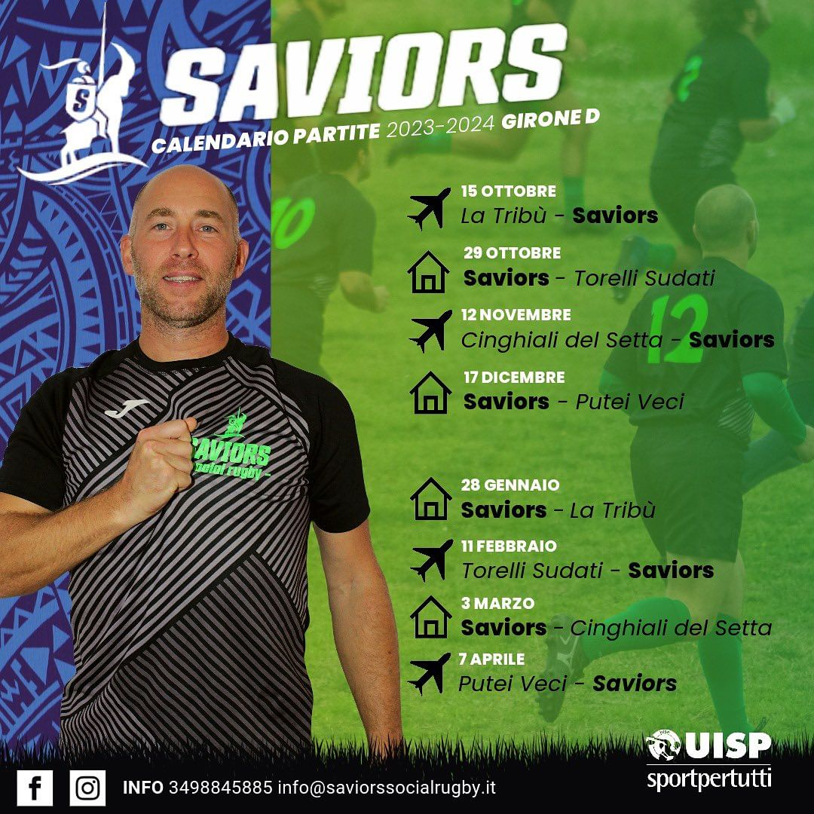

# XIV Campionato Nazionale Rugby UISP

## Classifica - Girone D

|     | Team                         | Punti | G/V/P | Pt. fatti | Pt. subiti | Mt. fatte | Mt. subite | Pt. bonus | Diff Pt. |
| --- | ---------------------------- | ----- | ----- | --------- | ---------- | --------- | ---------- | --------- | -------- |
| 1   | **Saviors Social Rugby ASD** | 31    | 8/6/2 | 279       | 70         | 40        | 11         | 6         | 209      |
| 2   | Putei Veci Rugby             | 29    | 8/7/1 | 130       | 72         | 17        | 8          | 1         | 58       |
| 3   | La Tribù ASD                 | 20    | 8/4/4 | 161       | 131        | 22        | 18         | 3         | 30       |
| 4   | ASD Torelli Sudati RC        | 15    | 8/3/5 | 80        | 144        | 12        | 21         | 3         | -64      |
| 5   | Cinghiali del Setta Rugby    | 2     | 8/0/8 | 56        | 289        | 9         | 42         | 2         | -233     |

## Finali

### Semifinale Gold 2 - 19/05/2023

|                           | VS  |                              | Risultato | Mete | Orario |
| ------------------------- | --- | ---------------------------- | --------- | ---- | ------ | ------------ |
| Stella Rossa Rugby Milano | VS  | Rondoni Rugby ASD            | -         | -    | 15:00  | Milano       |
| Rugby Club Codogno        | VS  | **Saviors Social Rugby ASD** | -         | -    | 15:00  | Codogno (LO) |

### Semifinale Bowl 2 - 19/05/2023

|                  | VS  |                   | Risultato | Mete | Orario |
| ---------------- | --- | ----------------- | --------- | ---- | ------ | ------------------------ |
| Putei Veci Rugby | VS  | A.S. Rugby Milano | -         | -    | 15:00  | Mestre (VE)              |
| Variegati Rugby  | VS  | LionSabres        | -         | -    | 15:00  | Castelfranco Veneto (VT) |

### Semifinale Gold 1 - 05/05/2023

|                              | VS  |                           | Risultato | Mete  | Orario |
| ---------------------------- | --- | ------------------------- | --------- | ----- | ------ | -------------------------- |
| Rondoni Rugby ASD            | VS  | Stella Rossa Rugby Milano | 16 - 12   | 1 - 0 | 15:00  | Robegano (VE)              |
| **Saviors Social Rugby ASD** | VS  | Rugby Club Codogno        | 53 - 27   | 8 - 4 | 15:00  | Via Roversano 2815, Cesena |

### Semifinale Bowl 1 - 05/05/2023

|                   | VS  |                  | Risultato | Mete  | Orario |
| ----------------- | --- | ---------------- | --------- | ----- | ------ | -------- |
| A.S. Rugby Milano | VS  | Putei Veci Rugby | 9 - 17    | 0 - 3 | 15:00  | Milano   |
| LionSabres        | VS  | Variegati Rugby  | 14 - 31   | 2 - 5 | 15:00  | Rho (MI) |

### Quarti di Finale - 21/04/2023

|                              | VS  |                   | Risultato | Mete  | Orario |
| ---------------------------- | --- | ----------------- | --------- | ----- | ------ | -------------------------- |
| Stella Rossa Rugby Milano    | VS  | A.S. Rugby Milano | 52 - 17   | 8 - 2 | 15:00  | Milano                     |
| Rondoni Rugby ASD            | VS  | Putei Veci Rugby  | 14 - 10   | 2 - 1 | 15:00  | Robegano (VE)              |
| Rugby Club Codogno           | VS  | LionSabres        | 54 - 17   | 7 - 2 | 15:00  | Codogno (LO)               |
| **Saviors Social Rugby ASD** | VS  | Variegati Rugby   | 38 - 21   | 5 - 2 | 15:00  | Via Roversano 2815, Cesena |

## Calendario - Girone D

| Giornata   | Data       | Casa                         | Ospiti                       | Orario | Indirizzo                                                               |
| ---------- | ---------- | ---------------------------- | ---------------------------- | ------ | ----------------------------------------------------------------------- |
| 1a Andata  | 15/10/2023 | La Tribù ASD                 | **Saviors Social Rugby ASD** | 15:00  | via Vicinale Rivalta 233, Casale sul Sile (TV)                          |
| 2a Andata  | 29/10/2023 | **Saviors Social Rugby ASD** | ASD Torelli Sudati RC        | 14:30  | Via Roversano 2815, Cesena(FC)                                          |
| 3a Andata  | 12/11/2023 | Cinghiali del Setta Rugby    | **Saviors Social Rugby ASD** | 14:30  | Via Romita, 2/7, 40128 (BO)                                             |
| 4a Andata  | 26/11/2023 | **Saviors Social Rugby ASD** | RIPOSO                       | -      | -                                                                       |
| 5a Andata  | 17/12/2023 | **Saviors Social Rugby ASD** | Putei Veci Rugby             | 14:30  | Via Roversano 2815, Cesena(FC)                                          |
| 1a Ritorno | 28/01/2024 | **Saviors Social Rugby ASD** | La Tribù ASD                 | 14:30  | Via Roversano 2815, Cesena(FC)                                          |
| 2a Ritorno | 11/02/2024 | ASD Torelli Sudati RC        | **Saviors Social Rugby ASD** | 14:30  | Via Sydney Sonnino 1, Padova oppure Via Jacopo Corrado, 4, 35128 Padova |
| 3a Ritorno | 03/03/2024 | **Saviors Social Rugby ASD** | Cinghiali del Setta Rugby    | 14:30  | Via Roversano 2815, Cesena(FC)                                          |
| 4a Ritorno | 17/03/2024 | **Saviors Social Rugby ASD** | RIPOSO                       | -      | -                                                                       |
| 5a Ritorno | 07/04/2024 | Putei Veci Rugby             | **Saviors Social Rugby ASD** | 14:30  | Gesbury Park' Via Forte Gazzera 2, Mestre (VE)                          |

## Risultati - Girone D

### 5a Giornata - Ritorno - 07/04/2024

|                  | VS  |                           | Risultato | Mete |
| ---------------- | --- | ------------------------- | --------- | ---- |
| Putei Veci Rugby | VS  | Saviors Social Rugby      | 11-9      | 1-0  |
| La Tribù ASD     | VS  | Cinghiali del Setta Rugby | 38-12     | 6-2  |

### 4a Giornata - Ritorno - 17/03/2024

|                           | VS  |                  | Risultato | Mete |
| ------------------------- | --- | ---------------- | --------- | ---- |
| Cinghiali del Setta Rugby | VS  | Putei Veci Rugby | 5-8       | 1-1  |
| ASD Torelli Sudati RC     | VS  | La Tribù ASD     | 6-13      | 0-1  |

### 3a Giornata - Ritorno - 03/03/2024

|                              | VS  |                           | Risultato | Mete |
| ---------------------------- | --- | ------------------------- | --------- | ---- |
| **Saviors Social Rugby ASD** | VS  | Cinghiali del Setta Rugby | 69-0      | 11-0 |
| Putei Veci Rugby             | VS  | ASD Torelli Sudati RC     | 13-3      | 2-0  |

### 2a Giornata - Ritorno - 11/02/2024

|                       | VS  |                              | Risultato | Mete |
| --------------------- | --- | ---------------------------- | --------- | ---- |
| ASD Torelli Sudati RC | VS  | **Saviors Social Rugby ASD** | 20-0      | 4-0  |
| La Tribù              | VS  | Putei Veci Rugby             | 15-16     | 2-1  |

### 1a Giornata - Ritorno - 28/01/2024

|                              | VS  |                       | Risultato | Mete |
| ---------------------------- | --- | --------------------- | --------- | ---- |
| Cinghiali del Setta Rugby    | VS  | ASD Torelli Sudati RC | 5-12      | 1-2  |
| **Saviors Social Rugby ASD** | VS  | La Tribù ASD          | 41-14     | 7-2  |

### 5a Giornata - Andata - 17/12/2023

|                              | VS  |                  | Risultato | Mete |
| ---------------------------- | --- | ---------------- | --------- | ---- |
| Cinghiali del Setta Rugby    | VS  | La Tribù ASD     | 0-35      | 0-5  |
| **Saviors Social Rugby ASD** | VS  | Putei Veci Rugby | 24-5      | 4-1  |

### 4a Giornata - Andata - 26/11/2023

|                  | VS  |                           | Risultato | Mete |
| ---------------- | --- | ------------------------- | --------- | ---- |
| Putei Veci Rugby | VS  | Cinghiali del Setta Rugby | 45-7      | 7-1  |
| La Tribù ASD     | VS  | ASD Torelli Sudati RC     | 27-14     | 4-2  |

### 3a Giornata - Andata - 12/11/2023

|                           | VS  |                              | Risultato | Mete |
| ------------------------- | --- | ---------------------------- | --------- | ---- |
| Cinghiali del Setta Rugby | VS  | **Saviors Social Rugby ASD** | 10-57     | 1-6  |
| ASD Torelli Sudati RC     | VS  | Putei Veci Rugby             | 0-15      | 0-2  |

### 2a Giornata - Andata - 29/10/2023

|                              | VS  |                       | Risultato | Mete |
| ---------------------------- | --- | --------------------- | --------- | ---- |
| **Saviors Social Rugby ASD** | VS  | ASD Torelli Sudati RC | 54-0      | 8-0  |
| Pute Veci Rugby              | VS  | La Tribù ASD          | 17-9      | 2-0  |

### 1a Giornata - Andata - 15/10/2023

|                       | VS  |                              | Risultato | Mete |
| --------------------- | --- | ---------------------------- | --------- | ---- |
| ASD Torelli Sudati RC | VS  | Cinghiali del Setta Rugby    | 25-17     | 4-3  |
| La Tribù ASD          | VS  | **Saviors Social Rugby ASD** | 10-25     | 2-4  |
