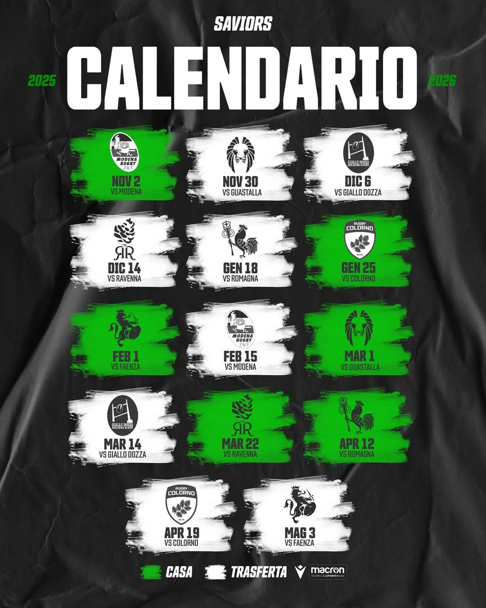

## Classifica

|     | Team                         | Punti | G/V/P/S  | Pt. fatti | Pt. subiti | Mt. fatte | Diff Pt. |
| --- | ---------------------------- | ----- | -------- | --------- | ---------- | --------- | -------- |
| 1   | Ravenna Rugby FC             | 27    | 7/5/0/2  | 243       | 94         | 37        | 149      |
| 2   | Modena Rugby 1965 nr. 2      | 27    | 7/5/0/1  | 201       | 101        | 28        | 100      |
| 3   | Faenza Rugby                 | 21    | 7/4/0/3  | 197       | 126        | 30        | 71       |
| 4   | Romagna RFC                  | 21    | 7/4/0/3  | 175       | 119        | 26        | 56       |
| 5   | **Saviors Social Rugby ASD** | 18    | 7/4/0/3  | 185       | 108        | 29        | 77       |
| 6   | Rugby Guastalla 2008         | 17    | 6/3/0/3  | 130       | 125        | 21        | 14       |
| 7   | Rugby Colorno 1975           | 2     | 7/1/0/6  | 104       | 184        | 14        | -80      |
| 8   | Giallo Dozza Bologna         | 0     | 65/0/0/6 | 33        | 420        | 5         | -387     |

## Calendario

| Giornata   | Data       | Orario | Casa                         | Ospiti                       | Indirizzo                                |
| ---------- | ---------- | ------ | ---------------------------- | ---------------------------- | ---------------------------------------- |
| 1ᵃ Andata  | 02/11/2025 | 14:30  | **Saviors Social Rugby ASD** | Modena Rugby 1965 nr. 2      | Via Roversano 2815, 47522 - Cesena (FC)  |
| 2ᵃ Andata  | 30/11/2025 | 14:30  | Rugby Guastalla 2008         | **Saviors Social Rugby ASD** | Ferrarini - Guastalla (RE)               |
| 3ᵃ Andata  | 06/12/2025 | 14:30  | Giallo Dozza Bologna         | **Saviors Social Rugby ASD** | Carcere, Fornace, Navile, Dozza, Bologna |
| 4ᵃ Andata  | 14/12/2025 | 14:30  | Ravenna Rugby FC             | **Saviors Social Rugby ASD** | Sadio Muccinelli, Lugo (RA)              |
| 5ᵃ Andata  | 17/01/2026 | 14:30  | Romagna RFC                  | **Saviors Social Rugby ASD** | Campo Rivabella - Rimini                 |
| 6ᵃ Andata  | 25/01/2026 | 14:30  | **Saviors Social Rugby ASD** | Rugby Colorno 1975           | Via Roversano 2815, 47522 - Cesena (FC)  |
| 7ᵃ Andata  | 01/02/2026 | 14:30  | **Saviors Social Rugby ASD** | Faenza Rugby                 | Via Roversano 2815, 47522 - Cesena (FC)  |
| 1ᵃ Ritorno | 15/02/2026 | 14:30  | Modena Rugby 1965 nr. 2      | **Saviors Social Rugby ASD** | Modena (MO)                              |
| 2ᵃ Ritorno | 01/03/2026 | 14:30  | **Saviors Social Rugby ASD** | Rugby Guastalla 2008         | Via Roversano 2815, 47522 - Cesena (FC)  |
| 3ᵃ Ritorno | 14/03/2026 | 14:30  | Giallo Dozza Bologna         | **Saviors Social Rugby ASD** | Carcere, Fornace, Navile, Dozza, Bologna |
| 4ᵃ Ritorno | 22/03/2026 | 13:00  | **Saviors Social Rugby ASD** | Ravenna Rugby FC             | Via Roversano 2815, 47522 - Cesena (FC)  |
| 5ᵃ Ritorno | 12/04/2026 | 15:30  | **Saviors Social Rugby ASD** | Romagna RFC                  | Via Roversano 2815, 47522 - Cesena (FC)  |
| 6ᵃ Ritorno | 19/04/2026 | 15:30  | Rugby Colorno 1975           | **Saviors Social Rugby ASD** | Stadio Gino Maini - Colorno              |
| 7ᵃ Ritorno | 03/05/2026 | 15:30  | Faenza Rugb                  | **Saviors Social Rugby ASD** | Via Viara, Castel San Pietro Terme (BO)  |
