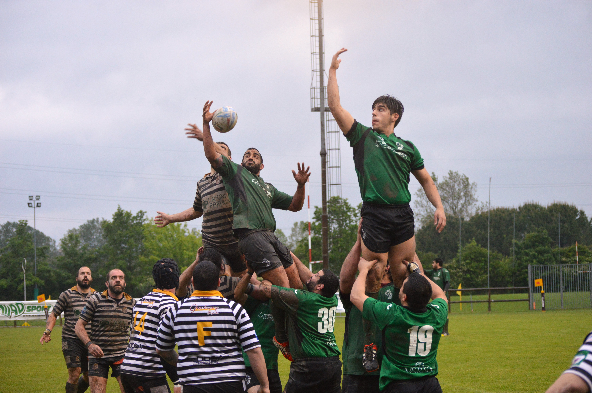

Nel lontano 2007, un coraggioso gruppo di giocatori veterani decise di intraprendere un nuovo capitolo nella loro passione per il rugby abbandonando il Cesena Rugby.

Nacque l'**OLD CESENA RUGBY**, una squadra dedicata a coloro che, nonostante l'età, desideravano continuare a giocare e a condividere la loro esperienza sul campo. La squadra non si limitò solo ai confini nazionali, ma partecipò attivamente ai principali tornei di categoria sia in Italia che all'estero, portando il nome di Cesena con fierezza attraverso il mondo del rugby.

Nel 2009, la squadra decise di investire nel futuro del rugby, lanciando il progetto [**MONELLI**](/training-under/). Questo programma era dedicato alle categorie giovanili, aprendo le porte del mini rugby per i giovani talenti e curiosi della regione. Era un impegno a garantire che la passione per questo sport fosse trasmessa alle generazioni future, creando un solido legame tra la storia della squadra e il suo futuro.

Il 2017 segnò un nuovo capitolo nella storia dei Saviors quando atleti desiderosi di gioco e divertimento trovarono una nuova casa a **Mulino 100**.
Con il **Campionato UISP** pronti ad accoglierli, la squadra senior si [impose fin da subito](/posts/palmares/) come una forza dominante nel torneo. L'impegno, la determinazione e la fratellanza all'interno della squadra li resero rapidamente protagonisti rispettati nel panorama rugby italiano.

La stagione 2018/2019 fu un punto culminante per i Saviors. La squadra senior, con la sua abilità e il suo spirito di squadra instancabile, trionfò **vincendo il Campionato UISP**.
Questa vittoria fu un riconoscimento del duro lavoro svolto nel corso degli anni e una testimonianza della dedizione di ogni singolo giocatore.

Il 2021 portò con sé un nuovo capitolo nella storia della squadra con un cambio di nome che rifletteva il loro impegno non solo nel rugby ma anche nella comunità. Nacque così il **Savior Social Rugby ASD**, sottolineando l'importanza della squadra nel tessuto sociale di Cesena.

Nella stagione 2022/2023, i Saviors continuarono a dimostrare la propria supremazia, ottenendo una nuova vittoria nel Campionato UISP. Il trionfo, questa volta con un risultato ex aequo con il Rugby Rho, sottolineò ancora una volta la costante eccellenza della squadra e la sua capacità di affrontare sfide sempre più impegnative.

Tuttavia, la stagione fu segnata da un evento straordinario che avrebbe influenzato profondamente il corso degli eventi. Un'importante alluvione nel corso dell'anno 2023 colpì la città, provocando una tragedia senza precedenti. In un gesto di nobiltà e solidarietà, i Saviors, nonostante avessero guadagnato il diritto di giocare la finale, presero la straordinaria decisione di rinunciare alla partita. Invece, dedicarono il loro tempo e le loro risorse per aiutare la città e i cittadini colpiti dalla catastrofe.

Questa scelta disinteressata non solo dimostrò la grandezza della squadra non solo sul campo, ma anche come parte integrante della comunità. I Saviors si trasformarono così da eroi sportivi a veri e propri salvatori nella vita di coloro che avevano bisogno di aiuto. La loro decisione di mettere da parte la gloria personale per concentrarsi sull'assistenza alla comunità segnò un capitolo indelebile nella storia della squadra e consolidò ulteriormente il loro status di modello di integrità e spirito di squadra.

In conclusione, la storia dei Saviors di Cesena è un racconto epico di passione, impegno e successo nel mondo del rugby. Dal loro umile inizio nel 2007, i Saviors hanno dimostrato che con determinazione e spirito di squadra, è possibile superare ogni ostacolo. Che la loro storia continui a ispirare generazioni di giocatori a abbracciare il rugby con la stessa dedizione e passione che ha guidato i Saviors di Cesena lungo il loro straordinario viaggio.

### Principali Tappe

#### 2007

Un folto gruppo di giocatori veterani decide di lasciare il Cesena Rugby e fonda l'**OLD CESENA RUGBY** per continuare la pratica del gioco come "veterani". La squadra partecipa attivamente ai principali tornei di categoria in Italia e all'estero.

#### 2009

Inizia il progetto dei **MONELLI**, dedicato alle categorie del mini rugby.

#### 2017

Atleti in cerca di gioco e divertimento trovano casa a Mulino 100, con il Campionato UISP pronto ad accoglierli. La squadra senior si colloca fin da subito ai vertici del torneo.

#### Stagione 2018/2019

La squadra senior raggiunge il successo, vincendo il Campionato UISP nella stagione 2018/2019.

#### 2021

Si verifica un cambio di nome all'interno della società, dando vita al **Savior Social Rugby ASD**.

#### Stagione 2022/2023

La squadra senior ottiene una nuova vittoria nel Campionato UISP nella stagione 2022/2023, con un risultato ex aequo con il Rugby Rho.
