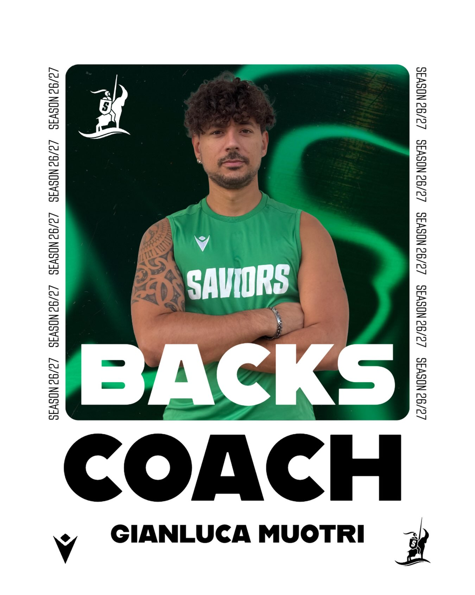

Arrivato da relativamente poco nella famiglia Saviors, Mitra ha impiegato circa 12 minuti per integrarsi nel gruppo.

Già lo scorso anno aveva iniziato a mettere le mani sulla nostra linea dei trequarti, affiancando l'Head Coach nel ruolo di secondo. Quest'anno, però, è arrivato il momento della consacrazione: Mitra prende il comando! 💪🏻

Il suo obiettivo è molto semplice: trasformare ogni nostro trequarti in una macchina da guerra capace di fare side step, cambi di direzione, finte, intercetti e acrobazie varie. Il problema è che nessuno sa esattamente dove finisca il rugby e dove inizi il circo 🎪

L'unica vera preoccupazione riguarda la sua seconda grande passione: la permanente 💇🏻
 Sappiamo già che proverà a convincere l'intera linea dei trequarti che il riccio è parte integrante del piano di gioco.

E attenzione: perché nella formazione della domenica potrebbe avere un peso importante anche il lato estetico del giocatore. Funzionale sì… ma, quantomeno, che sia bello! 💅

Benvenuto Mitra.
 Allenatore, preparatore atletico, parrucchiere ufficiale e futuro responsabile immagine dei Saviors 💚🐐🖤
