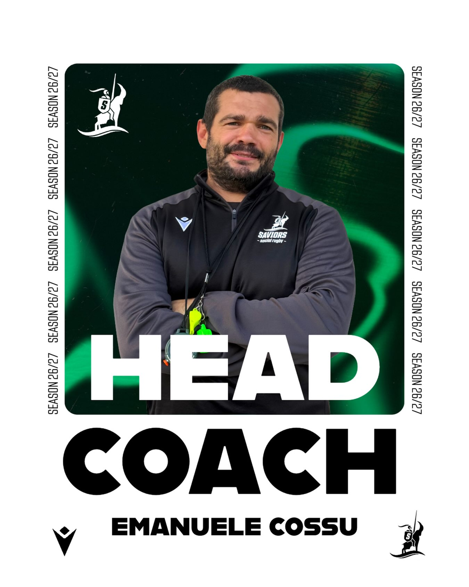

Rugbysticamente parlando, forse uno dei giocatori più forti che la Romagna abbia mai visto. E nonostante l'età, quando mette piede in campo riesce ancora a dare una pista a tutti i ragazzini, come se avesse scoperto il misterioso segreto di Benjamin Button.

Da fuori, però, non gli daresti due lire.

La sua iconica canotta arancione, che probabilmente ha combattuto almeno due guerre mondiali, il pelo che fuoriesce prepotentemente da ogni lato e quell'aria da uomo che ha appena finito di aggiustare un trattore non fanno certo pensare a un atleta di alto livello.

Poi entra in campo.

E lì cambia tutto.

Basta un attimo per vedere ringiovanire il nostro Cossu: parte la trasformazione, comincia a menare chiunque gli si presenti davanti, ricordandoci perché, rugbysticamente parlando, è meglio non giudicare mai un libro dalla copertina.

Ma quest'anno la musica cambia.

Dopo averci regalato in questi anni grandi dimostrazioni delle sue capacità da vice allenatore, Emanuele è pronto ad affrontare una nuova, affascinante e soprattutto pericolosa sfida: il ruolo di HEAD COACH.

E qui viene il bello.

Da Head Coach avrà finalmente carta bianca per trasformare la squadra secondo la sua visione: sudore, sacrificio, disciplina e una quantità di botte probabilmente non prevista dal regolamento.

Si prevede quindi una stagione intensa.

Botte.
 Birre.
 Ancora botte.

E, nel tempo libero, anche qualche allenamento.

Benvenuto nel tuo nuovo ruolo, Coach.
 Che Benjamin Button sia con te… e soprattutto con noi.
