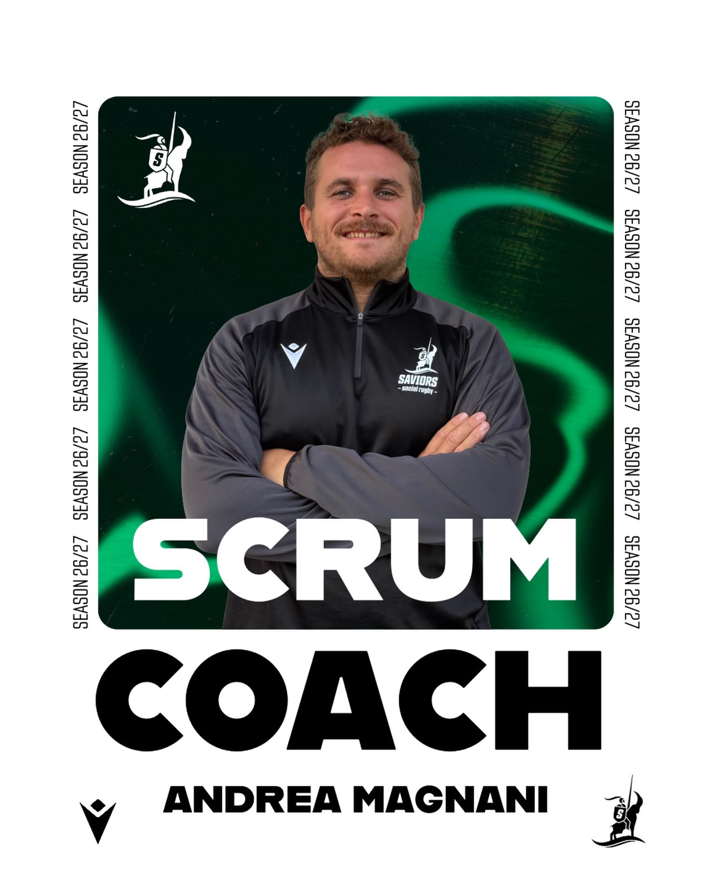

Quando si parla di reparto degli avanti, servono esperienza, carattere, cuore e soprattutto qualcuno che sappia cosa significa spingere. E per questo ruolo, Andrea Magnani è una garanzia. 🚜💪

Da ormai anni è parte della famiglia Saviors e quest’anno lo ritroviamo alla guida degli avanti come Scrum Coach, pronto a mettere tutta la sua esperienza e la sua passione al servizio della squadra.

Rugbisticamente parlando, Andrea è un vero trattore: uno che non molla, che ci mette tutto quello che ha e che conosce bene il significato di impegno, cuore e dedizione. E quest’anno si presenta addirittura in forma smagliante, pronto a guidare il pacchetto là dove conta di più: in mischia. 🔥

Ma c’è un lato di Andrea che abbiamo imparato a conoscere particolarmente bene l’anno scorso, quando un infortunio lo ha costretto a stare fermo: quello del grigliatore professionista. 🥩🔥

E lì abbiamo capito una cosa: Andrea è un uomo decisamente multitasking. Se non può spingere in mischia, spinge sulla carbonella. Se non può arare il campo, ara la griglia. 😂

Insomma, esperienza, muscoli e brace sempre pronta.

Benvenuto nel ruolo di Scrum Coach, Andrea!
 Gli avanti sono nelle tue mani…😉🏉🔥
