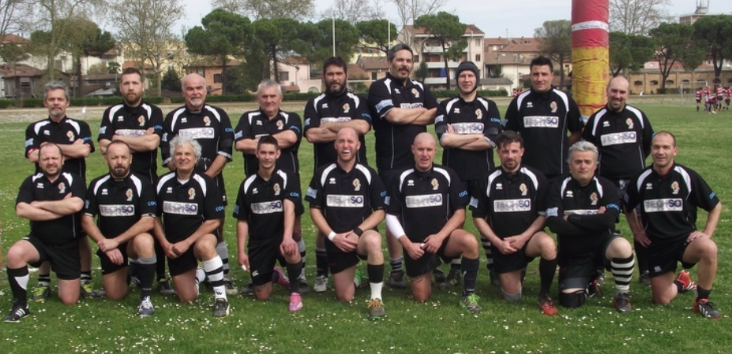
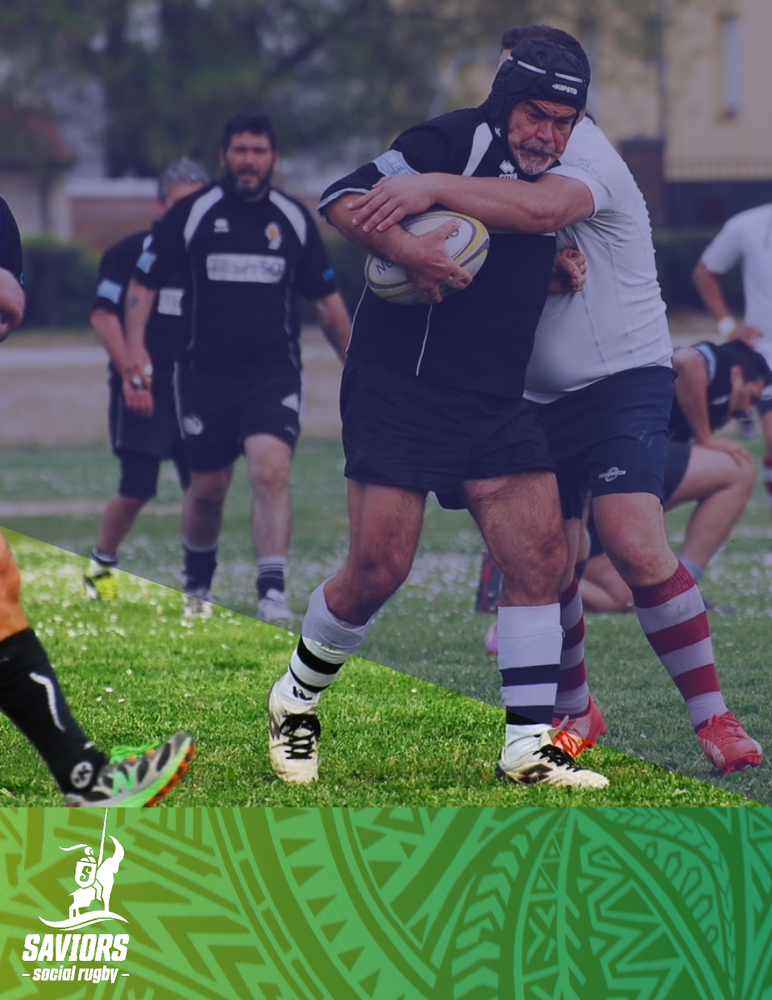

Lo spirito del giocatore **OLD** continua ad esprimersi attraverso il benessere fisico ed il divertimento che deriva dai tornei fra pari, praticati in campo e, finite le partite, in Club House per il terzo tempo.

Fuori dal campo il movimento **OLD** assicura assistenza per la gestione di spazi ed attività ancillari indispensabili per la vita della Società.

Un aspetto altrettando significativo è quello sociale; ogni settimana molti giocatori Old di ogni epoca si ritrovano presso la Club House di Mulino 100 per trascorrere insieme tempo di qualità!

