Il progetto parte dall'idea di poter dare uno stimolo sociale alla Valle del Savio, comunità ricca di capacità e potenzialità ma spesso esclusa da progettazioni e attività tutte concentrate in Cesena.
L'idea è di scuotere il segmento dagli 11 ai 14 anni sviluppando un'attività che possa coadiuvare lo sforzo della scuola e dei genitori per lo sviluppo psico-fisico dei ragazzi.

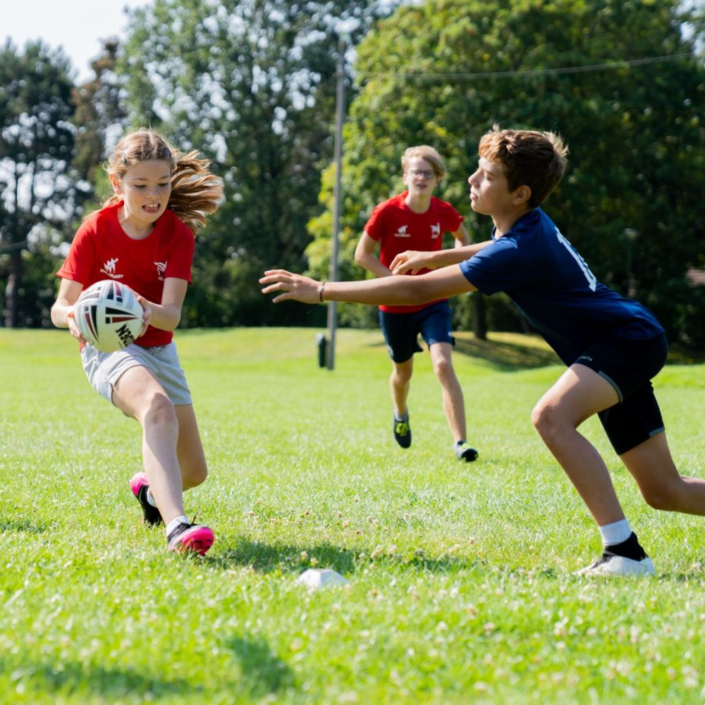

Lo sport è in grado di produrre benefici, a partire da quelli fisici e mentali per la persona fino a quelli sociali per una comunità o un Paese. 
Il valore dello sport è multidimensionale, riguarda diversi ambiti della vita quotidiana di ognuno, allena i muscoli, il cervello, ma anche il rispetto, la disciplina, la capacità di relazione. 
L'Italia si posiziona all'ultimo posto tra i Paesi OCSE per bambini sedentari, con una quota del 94,5% di bambini tra 11-15 anni che non praticano un adeguato livello di attività fisica (rispetto a una media OCSE dell'86,3%). 
La pratica regolare di uno sport estende i benefici anche allo studio con maggiore autocontrollo, una concentrazione più duratura e una migliore memoria e apprendimento; la disciplina acquisita porta a più ore di studio e meno giorni di scuola persi.

Il rugby unisce all'aspetto educativo di ogni sport ulteriori valori, nati dalla sua peculiarità di essere uno sport collettivo di contatto. Entrare in contatto con l'avversario, dover conquistare sempre terreno per raggiungere la meta sono due elementi del gioco che spostano immediatamente l'attenzione sul ruolo del singolo e del collettivo, sulle basi – fisiche e morali – che ogni giocatore deve possedere per svolgere il proprio compito e cercare di prevalere in modo sportivo ed etico sull'avversario. In quest'ottica la sconfitta non è elemento negativo ma parte di un percorso che fortifica chi lo intraprende.

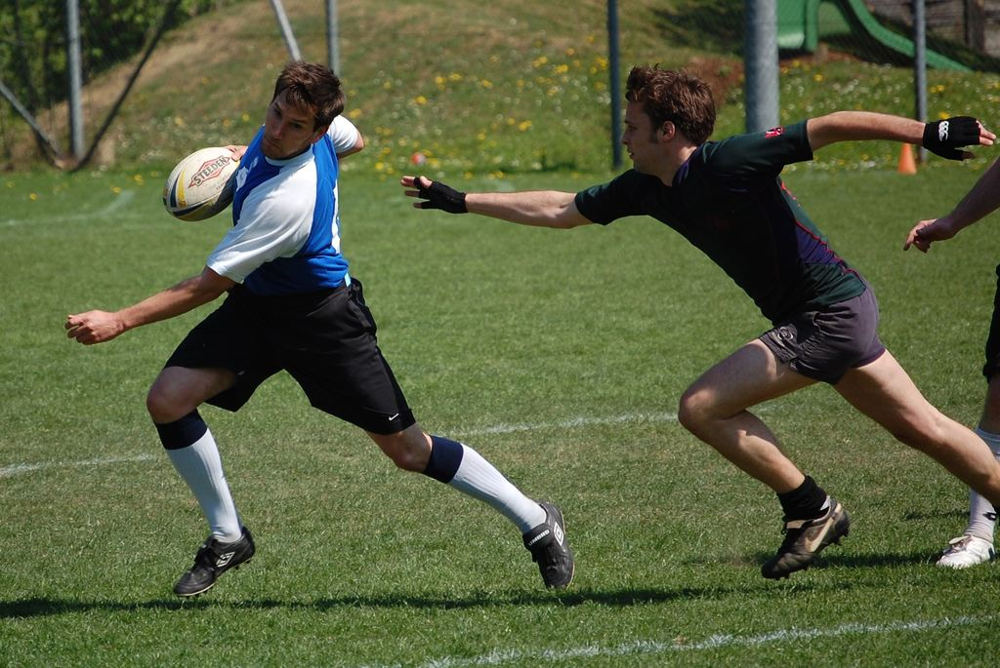

Il progetto creato da **Saviors Social Rugby** ha come scopo far conoscere regole apprese come esigenza per la vita del gioco e il rispetto del diritto di giocare e del diritto di difendere, permettendo a chi gioca di considerare l'opponente come un compagno di gioco e non come un nemico e di temperare il carattere e far crescere la propria autostima.

Sport ed alimentazione poi devono viaggiare su binari paralleli, in quanto fattori complementari per il raggiungimento di uno stato di salute ottimale. Per questo verranno effettuati interventi mirati a implementare una sana alimentazione correlata al dispendio energetico e sviluppo, inquadrando il concetto di corretti stili di vita attraverso delle lezioni tenute in classe da dietologi e nutrizionisti.

L'intervento verrà svolto in orario curriculare da educatori Saviors Social Rugby che ne sopporta interamente i costi. Il progetto si rivolge a tutti gli studenti, maschi e femmine, dei tre anni di corso.
Gli educatori porteranno ogni materiale necessario e gestiranno completamente l'allenamento utilizzando un programma condiviso con l'insegnante di scienze motorie referente.

Il gioco che verrà sviluppato sarà il “Touch Rugby” che mantiene lo spirito del rugby senza avere la fase di placcaggio, molto spettacolare ed allo stesso tempo con rischi molto limitati, perfettamente adatto per l'ambiente scolastico.

Il progetto si sviluppa in due fasi.

- **La prima fase** prevede di svolgere tre interventi per classe in orario curricolare da due ore ciascuno con cadenza bisettimanale, al fine di preparare gli alunni per la partecipazione ad un torneo interistituto di "Touch Rugby" da disputarsi nelle strutture dell' Istituto Scolastico.

- **La seconda fase** prevede di selezionare fra tutti quanti abbiano partecipato al torneo Touch almeno 12 alunni per istituto da preparare – in orario extracurricolare - alla Coppa Valle Savio, torneo a cui partecipano tutti gli Istituti Secondari Inferiori della Valle, sfruttando gli spazi pomeridiani destinati ai gruppi sportivi di istituto.

Viene prevista la partecipazione degli Istituti Scolastici ai Giochi Sportivi Studenteschi organizzati dal Coni.

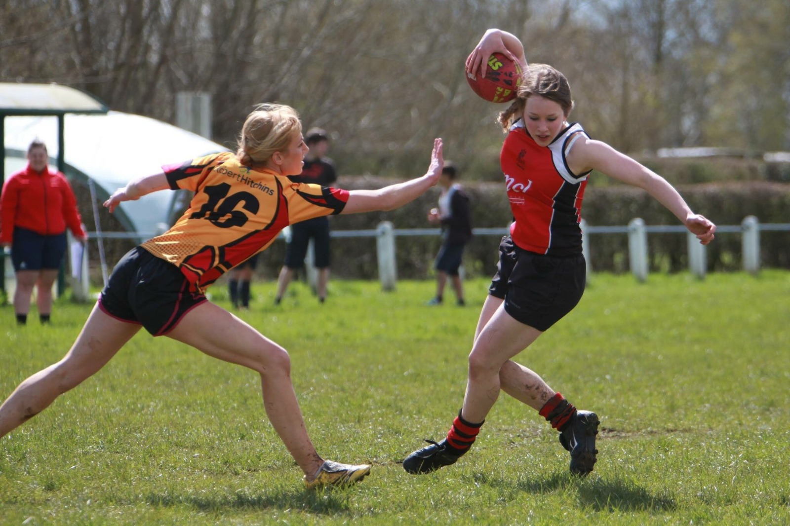

In funzione del gradimento che il rugby riceverà si considera, come obiettivo a media distanza, la possibile nascita di realtà sportive che in una fase iniziale possano svolgere attività Federale attraverso il tutoraggio con i Saviors e che in seguito possano portare alla costituzione di società sportive locali indipendenti.

#### Con il patrocinio dei comuni

  

    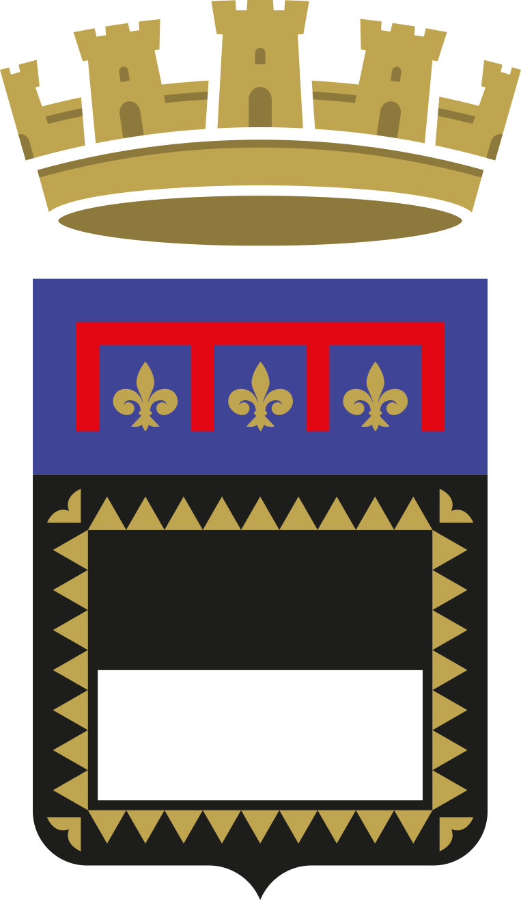
    <b>Cesena</b>
  

  

    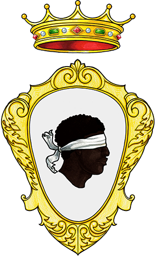
    <b>Mercato Saraceno</b>
  

  

    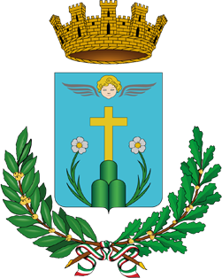
    <b>Sarsina</b>
  

  

    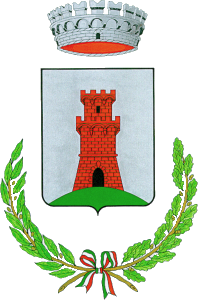
    <b>Bagno di Romagna</b>
  

  

    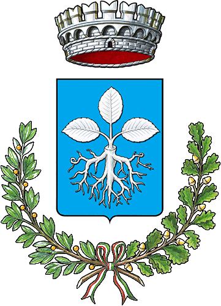
    <b>Verghereto</b>
  

#### In collaborazione con

   <b>Rotary Club Cesena Valle del Savio</b>

#### e il sostegno di

    <table>
    <tr>
        <td align="center"></td>
        <td align="center"></td>
    </tr>
    </table>

    <table>
    <tr>
        <td align="center">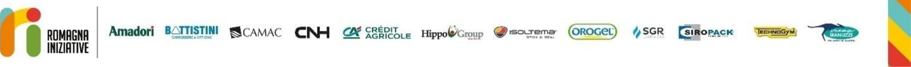</td>
    </tr>
    </table>

    <table>
    <tr>
        <td align="center">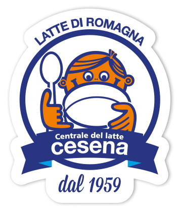</td>
        <td align="center">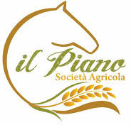</td>
    </tr>
    </table>

